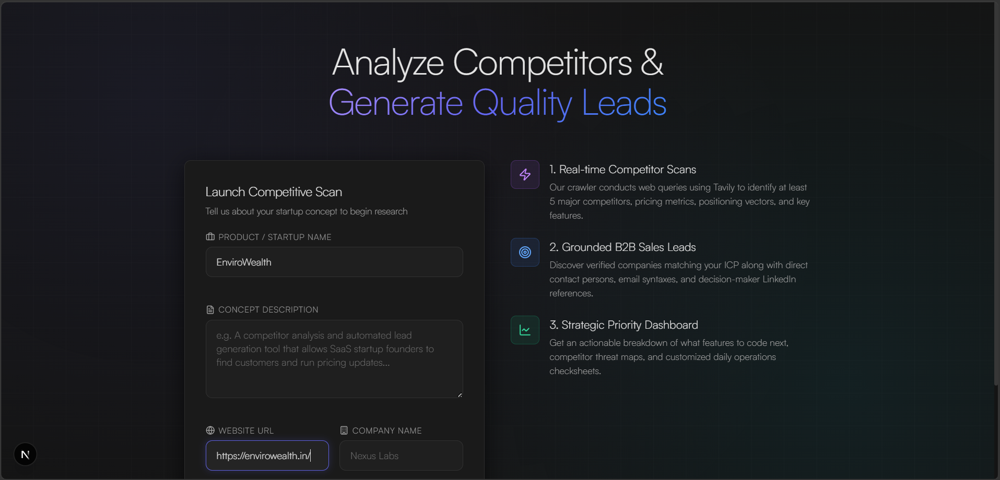
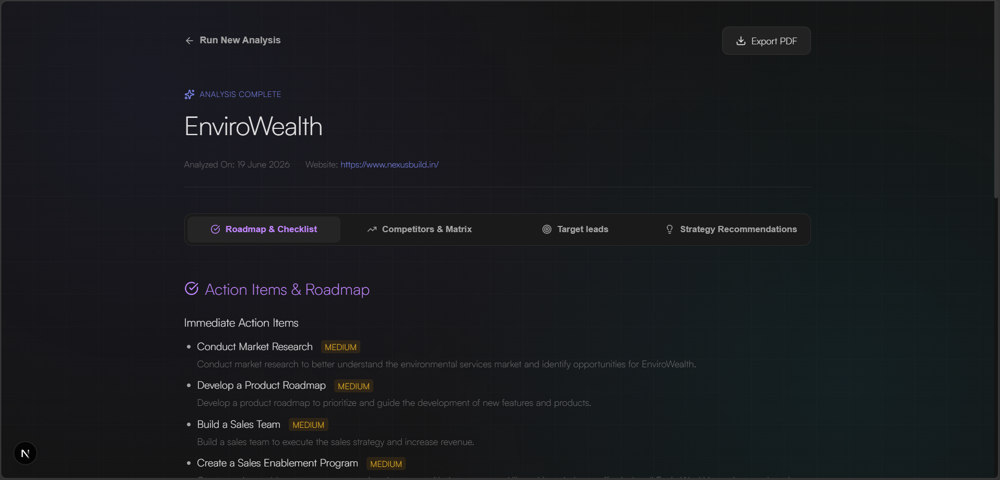
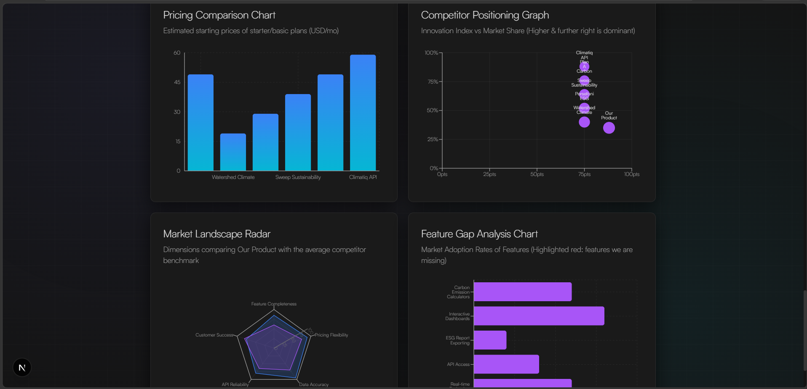
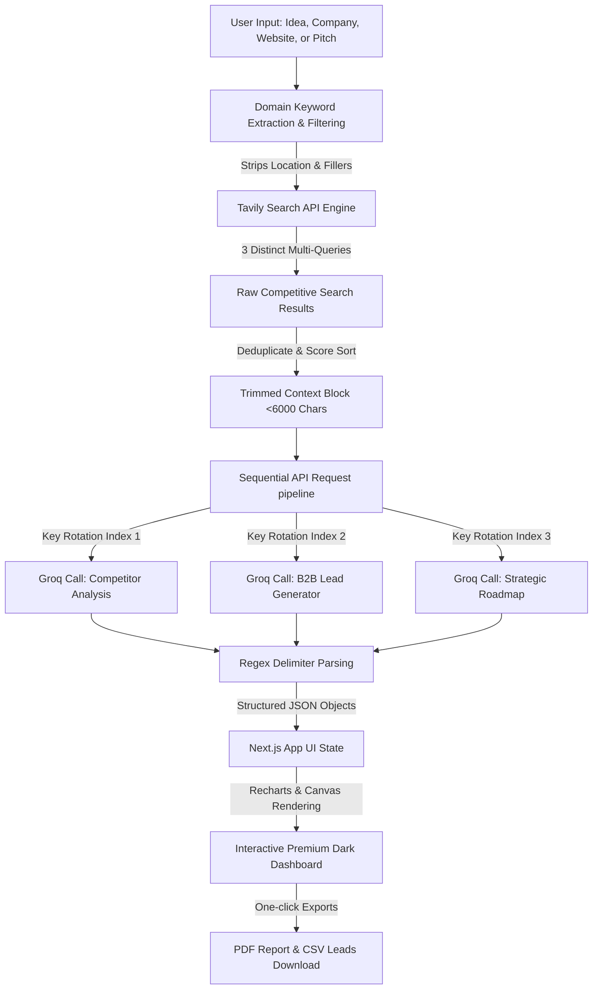

# 🛰️ Nexus Startup & Competitor Intelligence Hub

Nexus is a state-of-the-art AI-driven market intelligence platform. Designed for founders, startup teams, and product managers, it automates deep competitor research, maps feature and pricing matrices, evaluates strategic threats/opportunities, and generates verified sales leads.

---

## 📸 Interface Preview

Here is a visual walkthrough of the Nexus workspace:

### 1. Landing Interface & Idea Formulation
Input a product concept, website URL, company name, or startup pitch. No mandatory fields or strict validations are required to start a quick scan.


### 2. Interactive Competitor Comparison & Positioning Matrix
Analyze 5 real competitors with visual pricing tables, adoption matrixes, and live-rendered charts comparing market share, feature adoption, and innovation indices.


### 3. Strategy Roadmap & Lead Contact Board
Manage immediate actions, target leads, strategic recommendation plans, and download exports (B2B leads CSV, complete analysis PDF).


---

## ⚙️ How it Works (Flow Architecture)

The following diagram illustrates how user inputs are processed through search query optimization, rotated API endpoints, sequential LLM parsing, and rendering engines:



---

## 🚀 Key Features

* **Advanced Search Keyword Filters**: Automatically filters out geographical noise (e.g. `India`, `Surat`, `Gujarat`) and business filler verbs to keep Tavily queries focused on domain alternatives.
* **Auto-Rotated Groq API Key Loop**: Integrates multiple API keys (`GROQ_API_KEY`, `GROQ_API_KEY_2`, `GROQ_API_KEY_3`) to bypass free-tier Token-Per-Minute (TPM) rate limit ceilings.
* **Sequential Request Pipeline**: Replaced parallel requests with sequential processing combined with a 500ms delay to prevent simultaneous limit exhaustion.
* **4-Dimensional Data Visualization**:
  * **Competitor Positioning Chart**: Maps innovation index against market share.
  * **Landscape Radar**: Evaluates competitor metrics like API availability, feature adoption, data precision, and customer response times.
  * **Pricing Index**: Side-by-side comparative starter plans.
  * **Feature Adoption Rate**: Percentage of market alternatives adopting specific features.
* **CSV & PDF Exporter**: Instant download of leads for cold outreach and complete intelligence decks for stakeholders.
* **Cache & Limit Guards**: In-memory caching prevents duplicate external requests within 2 minutes, backed by an IP-based request throttle (10 requests/minute).

---

## 🛠️ Tech Stack

* **Frontend**: Next.js (App Router), React 19, TypeScript, Recharts, TailwindCSS.
* **Backend**: Serverless API Route Handlers.
* **AI & Search Engines**: Tavily Search Core SDK, Groq Llama-3.3-70b-versatile, Llama-3.1-8b-instant.
* **Exports & Utilities**: jsPDF, HTML2Canvas, Zod, Hashing algorithms.
* **Design Aesthetic**: Premium Dark Mode Theme (`#141414`), tailored HSL accent boundaries, and smooth micro-animations.

---

## 💻 Setup & Installation Instructions

### Prerequisites
Make sure you have **Node.js (v18.0.0 or higher)** installed.

### 1. Install Dependencies
Clone or download the project files, enter the directory, and run:
```bash
npm install
```

### 2. Set Up Environment Variables
Create a `.env` file in the root directory and add your keys:
```env
# Add up to 3 Groq keys for automatic rate-limit rotation
GROQ_API_KEY=gsk_your_primary_key_here
GROQ_API_KEY_2=gsk_your_second_key_here
GROQ_API_KEY_3=gsk_your_third_key_here

# Tavily API key for web search
TAVILY_API_KEY=tvly-dev-your_key_here
```

### 3. Launch Development Server
```bash
npm run dev
```
Open [http://localhost:3000](http://localhost:3000) in your browser.

---

## 📂 Project Architecture

```
├── app/
│   ├── api/
│   │   └── analyze/
│   │       └── route.ts         # Route Handler: Rate limits, caching, Zod guards
│   ├── layout.tsx               # Root Layout & Satoshi styling imports
│   └── page.tsx                 # Entry page: loading state, formulation form
├── components/
│   ├── analysis/
│   │   ├── AnalysisDashboard.tsx # Combined analytical dashboard view
│   │   └── CompetitorAnalysisTab.tsx # Competitor table & radar visuals
│   ├── dashboard/
│   │   └── FounderDashboardTab.tsx   # Feature roadmaps & threat indices
│   ├── landing/
│   │   └── LandingView.tsx           # Formulation form
│   ├── leads/
│   │   └── LeadGenerationTab.tsx     # B2B profiles & CSV exports
│   ├── recommendations/
│   │   └── RecommendationsTab.tsx    # Strategy recommendations
│   └── ui/
│       └── index.tsx            # Styled atomic primitives (Card, Badge, Button)
├── lib/
│   ├── analyzer.ts              # Analysis Orchestrator & Groq calling loops
│   ├── prompts.ts               # Structured prompts
│   ├── schemas.ts               # Input validators
│   ├── tavily.ts                # Search keyword filter & query builder
│   └── types.ts                 # TypeScript type schemas
├── public/
│   ├── image1.png               # Screenshot 1
│   ├── image2.png               # Screenshot 2
│   └── image3.png               # Screenshot 3
```

---

## 📋 Assumptions & Heuristics

1. **Competitor Pricing**: When specific plans are not found in the Tavily web search response, standard starter tiers are assumed at $29/mo or marked "Contact for pricing".
2. **Contact Inference**: If exact executive emails are not exposed in search indexes, standard corporate email formats (`first.last@company.com`) are generated and labeled with `ai_inferred`.
3. **Verified vs Inferred Status**: Values are labeled with either `verified` (direct match in web search index) or `inferred` (deduced by the strategy engine) to maintain transparency.
